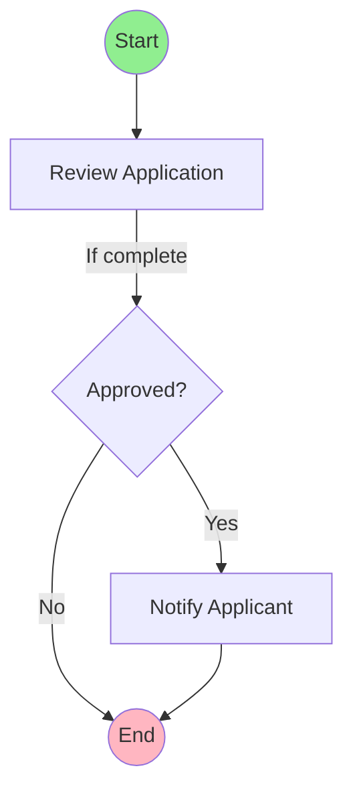

# Process Model Visualization - User Guide

## Overview

The Process Model Visualization feature enhances how Appian Process Models are displayed in the Merge Assistant. Instead of showing raw XML, you now see structured, human-readable information about process nodes, their properties, and visual flow diagrams.

## What's New

### Before
- Process models displayed as raw XML
- Difficult to understand what changed
- No visual representation of workflow
- Hard to identify dependencies

### After
- ✅ Structured node summaries with categorized properties
- ✅ Visual flow diagrams showing process structure
- ✅ Side-by-side three-way comparison
- ✅ Highlighted changes with before/after values
- ✅ Automatic dependency resolution (interfaces, rules, groups)

## Features

### 1. Structured Node Display

Process model nodes are now displayed with organized property groups:

#### Basic Information
- Node name and type
- Description
- Priority and deadline settings

#### Assignment Configuration
- Assignment type (User, Group, or Expression)
- Assigned users or groups (with resolved names)
- Assignment expressions

#### Form Configuration
- Interface name (resolved from UUID)
- Input and output mappings

#### Expressions
- Pre-activity expressions
- Post-activity expressions
- Output expressions (variable assignments)
- Formatted SAIL code with proper indentation

#### Escalation Rules
- Escalation timing
- Escalation actions
- Notification settings

#### Dependencies
- Referenced interfaces
- Referenced expression rules
- Referenced security groups

### 2. Visual Flow Diagrams

Process flows are displayed as interactive diagrams using Mermaid.js:

#### Node Shapes
- **Rectangles** - User Input Tasks and Script Tasks
- **Diamonds** - Gateways (decision points)
- **Rounded Rectangles** - Subprocesses
- **Circles** - Start and End nodes

#### Flow Indicators
- **Solid arrows** - Unconditional flows
- **Labeled arrows** - Conditional flows with conditions
- **Green highlighting** - Start nodes
- **Pink highlighting** - End nodes

#### Interactive Features
- Zoom and pan for complex diagrams
- Click nodes to see detailed properties
- Hover over flows to see conditions

### 3. Three-Way Comparison

When comparing process model versions, you see:

#### Node-Level Changes
- **Added nodes** - Shown in green with all properties
- **Removed nodes** - Shown in red with all properties
- **Modified nodes** - Shown in yellow with change details

#### Property-Level Changes
- Side-by-side before/after comparison
- Highlighted changed properties
- Detailed change summary table

#### Flow Changes
- Added flows (new connections)
- Removed flows (deleted connections)
- Modified flows (changed conditions)

## How to Use

### Viewing Process Model Changes

1. **Upload Applications**
   - Navigate to the Merge Assistant
   - Upload base, customer, and vendor versions
   - Click "Start Comparison"

2. **Navigate to Process Model**
   - In the comparison results, find process model changes
   - Click on a process model to view details

3. **Review Node Summary**
   - Scroll through the structured node list
   - Expand/collapse property groups as needed
   - Review dependencies and assignments

4. **View Flow Diagram**
   - Scroll to the "Process Flow" section
   - Use mouse wheel to zoom in/out
   - Click and drag to pan around the diagram
   - Click nodes to highlight them

5. **Compare Versions**
   - Scroll to the "Three-Way Comparison" section
   - Review base, customer, and vendor side-by-side
   - Check the changes summary table
   - Identify conflicts and merge decisions

### Understanding Node Types

#### User Input Task
**Purpose:** Collects input from users through an interface

**Key Properties:**
- Interface name (which form is displayed)
- Assignment (who completes the task)
- Input/output mappings (data flow)

**Example:**
```
Node: Review Application
Type: USER_INPUT_TASK
Interface: ReviewApplicationForm
Assigned To: Reviewers Group
```

#### Script Task
**Purpose:** Executes SAIL expressions to process data

**Key Properties:**
- Pre-activity expressions (run before task)
- Post-activity expressions (run after task)
- Output expressions (variable assignments)

**Example:**
```
Node: Calculate Approval Score
Type: SCRIPT_TASK
Output: pv!approvalScore = calculateScore(pv!application)
```

#### Gateway
**Purpose:** Makes routing decisions based on conditions

**Key Properties:**
- Outgoing flows with conditions
- Decision logic

**Example:**
```
Node: Check Approval Status
Type: GATEWAY
Flows:
  → Approved (if pv!approvalScore > 80)
  → Rejected (if pv!approvalScore <= 80)
```

#### Subprocess
**Purpose:** Calls another process model

**Key Properties:**
- Subprocess reference
- Parameter mappings

**Example:**
```
Node: Run Background Check
Type: SUBPROCESS
Subprocess: BackgroundCheckProcess
Parameters: applicantId = pv!applicantId
```

### Interpreting Flow Diagrams

#### Reading the Diagram



**Legend:**
- **Green circles** - Process starts here
- **Pink circles** - Process ends here
- **Rectangles** - Tasks that require action
- **Diamonds** - Decision points
- **Arrows** - Flow direction
- **Labels** - Conditions for taking that path

#### Common Patterns

**Sequential Flow:**
```
Task 1 → Task 2 → Task 3
```
Tasks execute in order, one after another.

**Conditional Branch:**
```
Task → Gateway → Task A (if condition)
              → Task B (else)
```
Process splits based on a condition.

**Parallel Execution:**
```
Task → Gateway → Task A
              → Task B
              → Task C
```
Multiple tasks execute simultaneously.

**Loop:**
```
Task 1 → Task 2 → Gateway → Task 1 (if not done)
                          → End (if done)
```
Tasks repeat until a condition is met.

### Understanding Changes

#### Change Types

**ADDED** (Green)
- New node or flow in the vendor version
- Not present in base or customer versions
- **Action:** Review and decide if you want to include it

**REMOVED** (Red)
- Node or flow present in base but not in vendor
- May still exist in customer version
- **Action:** Decide if removal is intentional or an error

**MODIFIED** (Yellow)
- Node or flow exists in both versions but properties changed
- **Action:** Review changes and decide which version to keep

**UNCHANGED** (No color)
- Node or flow is identical in both versions
- **Action:** No action needed

#### Property Changes

When a node is modified, you'll see a changes summary table:

| Property | Before | After |
|----------|--------|-------|
| properties.assignment.assignees | ['Managers'] | ['Senior Managers'] |
| properties.forms.interface_name | 'ReviewForm' | 'ReviewFormV2' |
| properties.expressions.output_expressions | pv!status = "pending" | pv!status = "in_review" |

**How to Read:**
- **Property** - The specific property that changed
- **Before** - Value in the base/customer version
- **After** - Value in the vendor version

#### Merge Decisions

For each change, consider:

1. **Is this change intentional?**
   - Check release notes or change logs
   - Verify with vendor documentation

2. **Does it conflict with customizations?**
   - Compare with customer version
   - Identify overlapping changes

3. **What's the impact?**
   - Will it break existing functionality?
   - Does it require data migration?
   - Are there dependency changes?

4. **Which version should I keep?**
   - Keep vendor if it's a bug fix or enhancement
   - Keep customer if it's a critical customization
   - Merge both if changes are complementary

## Best Practices

### Reviewing Process Models

1. **Start with the flow diagram**
   - Get a high-level understanding of the process
   - Identify major changes in structure
   - Look for added/removed nodes

2. **Review node-by-node**
   - Check each modified node's properties
   - Verify assignment changes
   - Review expression changes carefully

3. **Check dependencies**
   - Ensure referenced interfaces exist
   - Verify expression rules are available
   - Confirm security groups are correct

4. **Test the process**
   - After merging, test the complete workflow
   - Verify all paths work correctly
   - Check edge cases and error handling

### Common Issues

#### Issue: Interface UUID not resolved

**Symptom:** Shows "Unknown (_a-0001...)" instead of interface name

**Cause:** Interface not in object lookup (may be in a different package)

**Solution:**
- Check if interface exists in the application
- Verify interface is included in the package
- Look up UUID manually in Appian Designer

#### Issue: Flow diagram too complex

**Symptom:** Diagram is cluttered and hard to read

**Solution:**
- Use zoom controls to focus on specific areas
- Review nodes in the structured list instead
- Consider breaking large processes into subprocesses

#### Issue: Changes not showing

**Symptom:** Process model shows as unchanged but you know it changed

**Cause:** Changes may be in metadata or non-functional properties

**Solution:**
- Check the raw XML comparison
- Look for version UUID changes
- Review security or permission changes

## Tips and Tricks

### Keyboard Shortcuts

When viewing flow diagrams:
- **Mouse wheel** - Zoom in/out
- **Click + drag** - Pan around diagram
- **Double-click node** - Center on node

### Filtering Changes

Use the filter controls to focus on specific change types:
- Show only ADDED nodes
- Show only MODIFIED nodes
- Hide UNCHANGED nodes

### Exporting Information

You can export process model information:
- **Print to PDF** - Use browser print function
- **Copy node details** - Select and copy text
- **Screenshot diagram** - Use browser screenshot tools

### Comparing Multiple Versions

To compare more than two versions:
1. Run comparison for base vs. version 1
2. Run comparison for base vs. version 2
3. Compare the results side-by-side
4. Identify common changes and unique changes

## Troubleshooting

### Diagram Not Rendering

**Problem:** Flow diagram shows "Error generating diagram"

**Solutions:**
1. Refresh the page
2. Check browser console for errors
3. Verify Mermaid.js library is loaded
4. Try a different browser

### Slow Performance

**Problem:** Page loads slowly for large process models

**Solutions:**
1. Use pagination to view nodes in batches
2. Collapse property groups you don't need
3. Disable diagram auto-rendering for very large models
4. Use the structured list view instead of diagram

### Missing Information

**Problem:** Some node properties are empty

**Solutions:**
1. Check if properties exist in the original XML
2. Verify the process model is complete
3. Look for parsing errors in the logs
4. Contact support if data is definitely missing

## FAQ

**Q: Can I edit process models in the Merge Assistant?**

A: No, the Merge Assistant is read-only. Use it to understand changes, then make edits in Appian Designer.

**Q: How do I know which version to keep?**

A: Consider the business impact, technical dependencies, and whether changes conflict with customizations. When in doubt, consult with business stakeholders.

**Q: Can I export the flow diagram?**

A: Yes, right-click on the diagram and select "Save image as" or use your browser's screenshot tool.

**Q: What if the diagram is too large to view?**

A: Use the zoom controls to focus on specific areas, or review nodes in the structured list view instead.

**Q: How accurate is the UUID resolution?**

A: UUID resolution is 100% accurate for objects in the same package. Cross-package references may show as "Unknown" if the referenced object isn't included.

**Q: Can I compare more than three versions?**

A: The three-way comparison is designed for base, customer, and vendor. For more versions, run multiple comparisons and compare the results manually.

**Q: What happens if parsing fails?**

A: The system falls back to displaying raw XML. You can still view the process model, but without the enhanced visualization.

**Q: How do I report a bug or request a feature?**

A: Contact your system administrator or submit a ticket through your organization's support channel.

## Glossary

**Base Version** - The original version before any customizations or vendor updates

**Customer Version** - Your customized version with local changes

**Vendor Version** - The new version from the vendor with updates and fixes

**Node** - A step or activity in a process model (task, gateway, subprocess, etc.)

**Flow** - A connection between two nodes showing the process path

**Flow Graph** - The complete structure of all nodes and flows in a process

**UUID** - Universally Unique Identifier used by Appian to reference objects

**SAIL** - Appian's expression language used in interfaces and rules

**AC Element** - Activity Class element in process model XML containing node configuration

**Object Lookup** - Internal mapping of UUIDs to object names for resolution

**Three-Way Merge** - Comparing three versions (base, customer, vendor) to identify conflicts

## Additional Resources

- **Appian Documentation:** https://docs.appian.com/
- **Process Model Best Practices:** See Appian Community
- **SAIL Expression Reference:** See Appian Designer help
- **Merge Assistant Guide:** See main application documentation

## Support

For technical support or questions:
- Check the troubleshooting section above
- Review the FAQ
- Contact your system administrator
- Submit a support ticket

---

**Version:** 1.0  
**Last Updated:** November 2024  
**Applies To:** NexusGen Merge Assistant v2.0+
