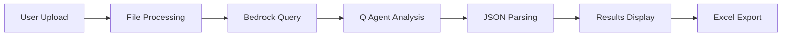
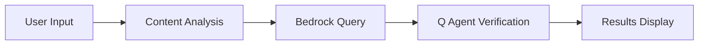
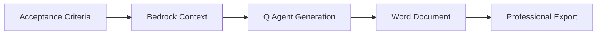
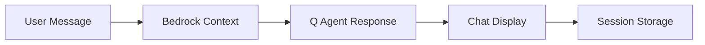

# NexusGen Document Intelligence Hub

> **Version 1.2.0** | A comprehensive Flask-based document intelligence application with AI-powered analysis and generation capabilities.

## 🚀 Overview

NexusGen is a modern document intelligence platform that leverages Amazon Q CLI agents and AWS Bedrock Knowledge Base to provide intelligent document processing, verification, and creation capabilities. Built with Flask and featuring a sleek dark-themed UI, it offers four core functionalities through an intuitive web interface.

### ✨ Key Features

- **📄 Spec Breakdown**: Upload documents and automatically generate structured user stories and acceptance criteria
- **✅ Design Verification**: Paste design documents for AI-powered validation and recommendations
- **🎨 Design Creation**: Generate comprehensive design documents from acceptance criteria
- **💬 AI Chat Assistant**: Interactive chat interface for document-related queries and assistance

## 🏗️ Architecture Overview

### System Components

```
nexus-gen-v2/
├── 🎮 controllers/          # Flask route handlers
│   ├── breakdown_controller.py    # Spec breakdown functionality
│   ├── verify_controller.py       # Design verification
│   ├── create_controller.py       # Design document creation
│   └── chat_controller.py         # AI chat interface
├── ⚙️ services/            # Business logic layer
│   ├── request_service.py         # Request management
│   ├── q_agent_service.py         # Q CLI agent integration
│   ├── bedrock_rag_service.py     # AWS Bedrock integration
│   ├── data_source_factory.py     # RAG service factory
│   ├── file_service.py            # File handling
│   ├── document_service.py        # Document processing
│   ├── excel_service.py           # Excel generation
│   └── word_service.py            # Word document generation
├── 🎨 templates/           # Jinja2 HTML templates
│   ├── breakdown/         # Spec breakdown pages
│   ├── verify/            # Design verification pages
│   ├── create/            # Design creation pages
│   ├── chat/              # AI chat interface
│   └── base.html          # Base template with navigation
├── 📁 static/             # Frontend assets
│   ├── css/docflow.css    # Custom dark theme styles
│   ├── js/main.js         # Core JavaScript utilities
│   └── js/upload.js       # File upload functionality
├── 🗄️ models.py           # SQLAlchemy database models
├── ⚙️ config.py           # Application configuration
├── 🧪 tests/              # Comprehensive test suite
└── 📊 outputs/            # Generated files and exports
```

## 🔄 Data Flow Architecture

### 1. Spec Breakdown Workflow


**Process Details:**
- **FileService**: Validates file types (PDF, DOCX, TXT, MD) and saves uploads
- **DocumentService**: Extracts content using appropriate parsers
- **BedrockRAGService**: Queries KB ID `WAQ6NJLGKN` for similar breakdowns
- **QAgentService**: Processes with `breakdown-agent` using Bedrock context
- **Enhanced JSON Parsing**: Robust error recovery and content cleaning
- **ExcelService**: Generates professional Excel reports with metrics

### 2. Design Verification Workflow


**Process Details:**
- **RequestService**: Manages verification requests and status tracking
- **BedrockRAGService**: Finds similar design documents for comparison
- **QAgentService**: Analyzes with `verify-agent` for missing objects and recommendations
- **Real-time Results**: Displays missing components, suggestions, and similar designs

### 3. Design Creation Workflow


**Process Details:**
- **RequestService**: Handles creation requests with input validation
- **BedrockRAGService**: Provides design templates and architectural patterns
- **QAgentService**: Generates comprehensive designs with `create-agent`
- **WordService**: Creates structured Word documents with proper formatting

### 4. AI Chat Workflow


**Process Details:**
- **ChatSession**: Persistent conversation tracking with UUID sessions
- **BedrockRAGService**: Contextual document retrieval for relevant responses
- **QAgentService**: Conversational AI with `chat-agent`
- **Real-time Interface**: Modern chat bubbles with typing indicators

## 🗄️ Database Schema

### Request Model
Tracks all breakdown, verification, and creation operations:

```sql
CREATE TABLE requests (
    id INTEGER PRIMARY KEY AUTOINCREMENT,
    action_type VARCHAR(20) NOT NULL,     -- 'breakdown', 'verify', 'create'
    filename VARCHAR(255),                -- uploaded file name (breakdown only)
    input_text TEXT,                      -- pasted content (verify/create)
    status VARCHAR(20) DEFAULT 'processing', -- 'processing', 'completed', 'error'
    rag_query TEXT,                       -- query sent to Bedrock
    rag_response TEXT,                    -- Bedrock API response
    final_output TEXT,                    -- Q Agent result (JSON format)
    export_path VARCHAR(500),             -- path to generated export file
    created_at DATETIME DEFAULT CURRENT_TIMESTAMP,
    updated_at DATETIME DEFAULT CURRENT_TIMESTAMP
);
```

### ChatSession Model
Manages AI chat conversations:

```sql
CREATE TABLE chat_sessions (
    id INTEGER PRIMARY KEY AUTOINCREMENT,
    session_id VARCHAR(36) NOT NULL,     -- UUID for session grouping
    question TEXT NOT NULL,              -- user message
    rag_response TEXT,                   -- Bedrock context used
    answer TEXT,                         -- AI response
    created_at DATETIME DEFAULT CURRENT_TIMESTAMP
);
```

## 🛠️ Service Layer Details

### QAgentService
**Purpose**: Interface with Amazon Q CLI agents for AI processing

**Key Features:**
- **Multi-Agent Support**: breakdown-agent, verify-agent, create-agent, chat-agent
- **Robust JSON Parsing**: Content cleaning, ANSI code removal, markdown stripping
- **Error Recovery**: Fallback responses when agents fail or timeout
- **Timeout Management**: 60-second timeout with graceful handling
- **Content Extraction**: Intelligent JSON extraction from mixed content

**Agent Configurations:**
```python
# Breakdown Agent
prompt = f"""
Analyze the spec document at: {file_path}
Context: {bedrock_summary}
Create JSON with exact structure:
{{"epic": "Name", "stories": [...]}}
Output ONLY valid JSON - no explanations
"""

# Verify Agent  
prompt = f"""
Verify design document: {content}
Context: {bedrock_context}
Analyze for missing objects and recommendations
Output JSON format: {{"status": "verified", "missing_objects": [...], "recommendations": [...]}}
"""
```

### BedrockRAGService
**Purpose**: AWS Bedrock Knowledge Base integration for contextual AI

**Configuration:**
- **Knowledge Base ID**: WAQ6NJLGKN (configurable via environment)
- **Model**: amazon.nova-pro-v1:0
- **Region**: us-east-1 (configurable)

**Key Features:**
- **Similarity Search**: Retrieves relevant documents based on query content
- **Citation Handling**: Processes S3 document references and metadata
- **Response Formatting**: Structures results with similarity scores and summaries
- **Fallback Responses**: Graceful degradation when Bedrock is unavailable
- **Error Handling**: Comprehensive logging and retry mechanisms

### WordService (New in v1.2.0)
**Purpose**: Generate professional Word documents for design exports

**Features:**
- **Structured Layout**: Proper headings, paragraphs, and bullet lists
- **Professional Formatting**: Centered titles, consistent spacing
- **Content Organization**: Overview, Objects & Components, Implementation Notes, Dependencies
- **Library**: python-docx for reliable document generation

**Document Structure:**
```
Design Document
├── Overview (paragraph)
├── Objects & Components
│   ├── Object Name (heading 2)
│   ├── Type & Description
│   └── Methods (bullet list)
├── Implementation Notes (bullet list)
└── Dependencies (bullet list)
```

## 🎨 Frontend Architecture

### UI Framework & Design System
- **Base Framework**: Bootstrap 5 with extensive customizations
- **Icon Library**: Font Awesome 6 for consistent iconography
- **Layout System**: Responsive flexbox with mobile-first approach
- **Theme**: Custom dark theme with purple (#8b5cf6) and teal (#06b6d4) accents

### Color Palette
```css
:root {
    --bg-primary: #0f1419;      /* Main background */
    --bg-secondary: #1a1f2e;    /* Sidebar background */
    --bg-card: #1a1f2e;        /* Card backgrounds */
    --text-primary: #f8fafc;    /* Primary text */
    --text-secondary: #94a3b8;  /* Secondary text */
    --purple: #8b5cf6;          /* Primary accent */
    --teal: #06b6d4;           /* Secondary accent */
    --pink: #ec4899;           /* Chat AI color */
    --green: #10b981;          /* Success color */
}
```

### Key UI Components

#### Collapsible Sidebar
- **Toggle Button**: Circular button at bottom with arrow indicators (< / >)
- **Persistent State**: localStorage saves collapsed/expanded preference
- **Smooth Transitions**: CSS transitions with no-flicker loading
- **Responsive Design**: Auto-collapse on mobile devices

#### Chat Interface (Redesigned in v1.2.0)
- **Message Alignment**: User messages right-aligned, AI messages left-aligned
- **Bubble Design**: Rounded chat bubbles with proper corner radius
- **Avatar System**: 40px circular avatars (teal for user, pink for AI)
- **Input Design**: Rounded input field with embedded circular send button
- **Typing Indicators**: Animated dots during AI response generation

#### Form Components
- **Consistent Styling**: Black backgrounds with white text across all inputs
- **Focus States**: Purple/teal focus borders matching page themes
- **Placeholder Text**: White placeholders with 70% opacity
- **Validation**: Real-time client-side validation with server confirmation

### JavaScript Modules

#### main.js - Core Utilities
```javascript
// Sidebar state management
function initSidebarToggle() {
    // Load saved state, handle transitions, persist changes
}

// Notification system
DocFlow.showNotification(message, type);

// Loading states
DocFlow.showLoading(element);
DocFlow.hideLoading(element);
```

#### upload.js - File Upload System
```javascript
// Drag and drop functionality
// Progress tracking with step-by-step feedback
// Error handling and file validation
// Real-time upload status updates
```

## ⚙️ Configuration Management

### Environment Variables
```bash
# AWS Configuration
AWS_REGION=us-east-1
BEDROCK_KB_ID=WAQ6NJLGKN

# Application Security
SECRET_KEY=your-production-secret-key

# Database (SQLite by default)
SQLALCHEMY_DATABASE_URI=sqlite:///docflow.db

# File Upload Limits
MAX_CONTENT_LENGTH=16777216  # 16MB
```

### File Handling Configuration
```python
# Supported file types
ALLOWED_EXTENSIONS = {'txt', 'md', 'docx', 'pdf'}

# Directory structure
BASE_DIR = Path(__file__).parent
UPLOAD_FOLDER = BASE_DIR / 'uploads'
OUTPUT_FOLDER = BASE_DIR / 'outputs'
```

## 🚀 Installation & Setup

### Prerequisites
- **Python**: 3.8 or higher
- **AWS CLI**: Configured with appropriate permissions
- **Amazon Q CLI**: Installed and configured
- **Git**: For repository cloning

### Quick Start

1. **Clone Repository**
```bash
git clone <repository-url>
cd nexus-gen-v2
```

2. **Create Virtual Environment**
```bash
python -m venv .venv
source .venv/bin/activate  # On Windows: .venv\Scripts\activate
```

3. **Install Dependencies**
```bash
pip install -r requirements.txt
```

4. **Configure Environment**
```bash
export AWS_REGION=us-east-1
export BEDROCK_KB_ID=WAQ6NJLGKN
export SECRET_KEY=your-secret-key
```

5. **Initialize Database**
```bash
python -c "from app import create_app; from models import db; app = create_app(); app.app_context().push(); db.create_all()"
```

6. **Run Application**
```bash
python app.py
```

7. **Access Application**
Open browser to `http://localhost:5001`

### Production Deployment

#### Using Gunicorn
```bash
pip install gunicorn
gunicorn -w 4 -b 0.0.0.0:5001 app:app
```

#### Using Docker
```dockerfile
FROM python:3.11-slim
WORKDIR /app
COPY requirements.txt .
RUN pip install -r requirements.txt
COPY . .
EXPOSE 5001
CMD ["gunicorn", "-w", "4", "-b", "0.0.0.0:5001", "app:app"]
```

## 🧪 Testing & Quality Assurance

### Test Suite Overview
Comprehensive testing infrastructure with multiple test categories:

#### Test Categories
- **Health Tests**: Application health monitoring and system checks
- **Unit Tests**: Individual service and model testing
- **Integration Tests**: End-to-end workflow validation
- **Controller Tests**: API endpoint testing with mocked services
- **Performance Tests**: Memory usage and concurrent request handling

#### Running Tests

**Quick Health Check** (30 seconds):
```bash
./health_check.py
```

**Specific Test Categories**:
```bash
python run_tests.py --type health      # Health checks only
python run_tests.py --type unit        # Unit tests (models, services)
python run_tests.py --type integration # End-to-end workflows
python run_tests.py --type controllers # API endpoint tests
python run_tests.py --type performance # Performance benchmarks
python run_tests.py --type all         # Complete test suite
```

**Install Test Dependencies**:
```bash
pip install -r test_requirements.txt
```

#### Health Monitoring Features
- **Database Connectivity**: Ensures SQLite database is accessible
- **Route Accessibility**: Tests all main endpoints respond correctly
- **Bedrock Integration**: Validates AWS service connectivity
- **File Processing**: Tests document extraction and validation
- **JSON Parsing**: Validates Q Agent response handling
- **Error Handling**: Ensures graceful error responses
- **Memory Usage**: Monitors application resource consumption
- **Configuration Validation**: Checks all required settings

### Test Coverage Areas
```python
# Example health check test
def test_complete_breakdown_workflow(self):
    """Test end-to-end breakdown functionality"""
    # Upload file → Process → Generate breakdown → Export
    # Validates entire user journey
```

## 📈 Performance & Optimization

### Performance Characteristics
- **Response Times**: < 2 seconds for page loads
- **Memory Usage**: < 500MB during normal operation
- **File Processing**: Handles up to 16MB documents
- **Concurrent Users**: Supports multiple simultaneous requests
- **Q Agent Timeout**: 60 seconds for complex processing

### Optimization Strategies

#### Caching
- **Browser localStorage**: UI state persistence (sidebar, preferences)
- **Python bytecode**: Automatic .pyc file management
- **Static assets**: Proper cache headers for CSS/JS files

#### Resource Management
- **File Streaming**: Efficient large file processing
- **Memory Management**: Automatic cleanup of temporary files
- **Connection Pooling**: SQLAlchemy database connection optimization
- **Lazy Loading**: On-demand service initialization

#### Error Handling & Resilience
- **Graceful Degradation**: Fallback responses when services unavailable
- **Retry Logic**: Automatic retry for transient failures
- **Circuit Breaker**: Prevents cascade failures in service calls
- **Comprehensive Logging**: Detailed error tracking without sensitive data

## 🔒 Security Considerations

### Input Validation & Sanitization
- **File Type Validation**: Strict whitelist of allowed file extensions
- **Content Sanitization**: XSS prevention with Jinja2 auto-escaping
- **SQL Injection Prevention**: SQLAlchemy ORM with parameterized queries
- **File Size Limits**: 16MB maximum upload size
- **Path Traversal Protection**: Secure file storage with UUID naming

### Authentication & Authorization
- **Session Management**: Secure Flask sessions with secret key rotation
- **CSRF Protection**: Built-in Flask-WTF CSRF tokens
- **Input Validation**: Server-side validation for all user inputs
- **Error Information**: User-friendly messages without system details

### Data Protection
- **Sensitive Data Handling**: No storage of AWS credentials in code
- **Temporary File Cleanup**: Automatic removal of processed files
- **Audit Trail**: Complete request tracking for compliance
- **Environment Variables**: Secure configuration management

## 🔄 Version History & Changelog

### Version 1.2.0 (Current) - October 16, 2025

#### 🎨 Major UI/UX Enhancements

**Navigation & Layout Improvements:**
- ✅ **Collapsible Sidebar**: Added toggle button at bottom with circular design and arrow indicators (< / >)
- ✅ **Persistent State Management**: Sidebar collapse state saved in localStorage across page navigation
- ✅ **Smooth Transitions**: Added CSS transitions with no-flicker page loading using temporary no-transition classes
- ✅ **Full-width Chat Interface**: Removed card container constraints for immersive chat experience

**Page-Specific Optimizations:**
- ✅ **Spec Breakdown**: Removed preview panel, added inline progress indicators with real-time step-by-step feedback
- ✅ **Create Design**: Removed recent generations section, increased panel heights to standardized 600px
- ✅ **Verify Design**: Removed recent verifications section, standardized panel heights for consistency
- ✅ **Dashboard**: Removed bottom metrics section for cleaner, more focused interface

**Form & Input Enhancements:**
- ✅ **Consistent Input Styling**: Black backgrounds with white text and placeholders across all pages
- ✅ **Enhanced Focus States**: Purple/teal focus borders matching individual page themes
- ✅ **Improved Spacing**: Better padding, margins, and layout consistency throughout application

#### 💬 Complete Chat Interface Overhaul

**Message Layout & Design:**
- ✅ **Proper Message Alignment**: User messages right-aligned, AI messages left-aligned matching modern chat apps
- ✅ **Chat Bubble Design**: Rounded corners with different radius for each message type (user vs AI)
- ✅ **Avatar Positioning**: 40px avatars with proper left/right positioning based on sender
- ✅ **Color Scheme**: Purple background for user messages, pink background for AI messages

**Input & Interaction:**
- ✅ **Rounded Input Design**: Pill-shaped input field with embedded circular send button
- ✅ **Better Typography**: Improved font sizes and spacing for readability
- ✅ **Responsive Layout**: Full-width design that adapts to different screen sizes

#### 🔧 Critical Technical Improvements

**Q Agent System Enhancements:**
- ✅ **Robust JSON Parsing**: Added content cleaning, ANSI code removal, and markdown stripping
- ✅ **Error Recovery System**: Intelligent JSON extraction from mixed content with fallback responses
- ✅ **Timeout Management**: Increased timeout from 30s to 60s with proper error handling
- ✅ **Improved Prompts**: Simplified, more effective prompts with clear JSON structure requirements

**File Upload System Fixes:**
- ✅ **Event Handling**: Fixed double-trigger issues causing file dialog to open twice
- ✅ **State Management**: Proper file input reset after processing to allow same file re-selection
- ✅ **Progress Feedback**: Real-time progress updates with descriptive step messages

**Export Functionality Overhaul:**
- ✅ **Word Document Export**: Changed create design export from Excel to professional Word (.docx) format
- ✅ **Document Structure**: Proper headings, bullet lists, and professional formatting
- ✅ **New WordService**: Dedicated service using python-docx for reliable document generation

#### 🧪 Comprehensive Testing Infrastructure

**Test Suite Development:**
- ✅ **Health Check System**: Quick 30-second health validation for deployment confidence
- ✅ **Categorized Testing**: Organized tests by type (health, unit, integration, controllers, performance)
- ✅ **Performance Monitoring**: Memory usage tracking and concurrent request handling tests
- ✅ **Integration Validation**: End-to-end workflow testing for all four core features

**Quality Assurance Tools:**
- ✅ **Automated Test Runner**: Enhanced test runner with detailed reporting and failure analysis
- ✅ **Health Monitoring Script**: Standalone script for production health checks
- ✅ **Test Coverage**: Comprehensive coverage of all critical application paths

#### 🛠️ Backend Architecture Improvements

**Service Layer Enhancements:**
- ✅ **Enhanced Error Handling**: Better exception handling with detailed logging across all services
- ✅ **Service Separation**: Clean separation between Excel and Word document generation services
- ✅ **Improved Logging**: More detailed error messages and debug information for troubleshooting

**Configuration & Deployment:**
- ✅ **Environment Management**: Better handling of AWS configuration and environment variables
- ✅ **Cache Management**: Automatic Python cache cleanup to prevent deployment issues
- ✅ **Directory Organization**: Improved file organization and cleanup policies

#### 📊 Data Management & Storage

**Request Tracking Improvements:**
- ✅ **Complete Audit Trail**: Enhanced tracking for all breakdown/verify/create operations
- ✅ **Chat History Management**: Persistent chat sessions with proper cleanup and organization
- ✅ **Export Path Tracking**: Better management of generated files for download and cleanup
- ✅ **Status Management**: Real-time status updates for long-running operations

#### 🎯 User Experience Enhancements

**Interface Standardization:**
- ✅ **Consistent Panel Heights**: Standardized 600px heights across create/verify pages for visual harmony
- ✅ **Better User Feedback**: Enhanced loading states, progress indicators, and success messages
- ✅ **Keyboard Shortcuts**: Proper Enter key handling in chat, improved form interactions
- ✅ **Responsive Design**: Better mobile and tablet compatibility across all features

#### 🔒 Reliability & Performance

**System Reliability:**
- ✅ **Timeout Management**: Proper handling of long-running Q Agent operations with user feedback
- ✅ **Memory Optimization**: More efficient file handling and automatic cleanup procedures
- ✅ **Error Recovery**: Graceful fallbacks when external services (Bedrock, Q Agents) are unavailable
- ✅ **State Persistence**: Reliable sidebar and form state management across sessions

### Technical Stack Updates
- ✅ **Added**: python-docx library for professional Word document generation
- ✅ **Enhanced**: Q Agent integration with robust JSON parsing and error handling
- ✅ **Improved**: Bedrock RAG service with comprehensive error handling and fallbacks
- ✅ **Optimized**: Frontend JavaScript for better user interactions and state management

### Breaking Changes
- ⚠️ **Export Format Change**: Design document export changed from Excel to Word format
- ⚠️ **Sidebar Behavior**: Sidebar state now persists across browser sessions
- ⚠️ **Chat Interface**: Complete redesign may affect users familiar with previous layout

### Migration Notes
- 🔄 **Browser Storage**: Clear localStorage if experiencing sidebar state issues
- 🔄 **Export Automation**: Update any automation expecting Excel exports to handle Word documents
- 🔄 **Timeout Handling**: Test Q Agent operations with new 60-second timeout limit

## 🤝 Contributing

### Development Setup
1. Fork the repository
2. Create feature branch: `git checkout -b feature/amazing-feature`
3. Install development dependencies: `pip install -r test_requirements.txt`
4. Run tests: `python run_tests.py --type all`
5. Commit changes: `git commit -m 'Add amazing feature'`
6. Push to branch: `git push origin feature/amazing-feature`
7. Open Pull Request

### Code Standards
- **Python**: Follow PEP 8 style guidelines
- **JavaScript**: Use ES6+ features with proper error handling
- **HTML/CSS**: Maintain Bootstrap 5 compatibility
- **Testing**: Add tests for new features
- **Documentation**: Update README for significant changes

### Development Guidelines
- Use factory pattern for data sources
- Implement proper error handling with fallbacks
- Follow Flask blueprint structure for new features
- Maintain dark theme consistency in UI changes
- Use Q CLI agents with --no-interactive flag
- Implement proper session management
- Follow OOP principles throughout codebase

## 📞 Support & Troubleshooting

### Common Issues

**Q Agent Timeout Errors:**
```bash
# Check Q CLI installation
q --version

# Verify agent availability
q chat --agent breakdown-agent --help
```

**Bedrock Connection Issues:**
```bash
# Verify AWS credentials
aws sts get-caller-identity

# Test Bedrock access
aws bedrock-agent-runtime retrieve-and-generate --help
```

**File Upload Problems:**
- Check file size (max 16MB)
- Verify file type (PDF, DOCX, TXT, MD only)
- Clear browser cache and localStorage

**Database Issues:**
```bash
# Recreate database
python -c "from app import create_app; from models import db; app = create_app(); app.app_context().push(); db.drop_all(); db.create_all()"
```

### Health Check Commands
```bash
# Quick health check
./health_check.py

# Detailed system check
python run_tests.py --type health

# Performance validation
python run_tests.py --type performance
```

### Logging & Debugging
- **Application logs**: Check `app.log` for detailed error information
- **Q Agent logs**: Monitor console output during agent execution
- **Browser console**: Check for JavaScript errors in developer tools
- **Network tab**: Monitor API calls and response times

## 📄 License

This project is licensed under the MIT License - see the LICENSE file for details.

## 🙏 Acknowledgments

- **Amazon Q CLI**: For powerful AI agent capabilities
- **AWS Bedrock**: For knowledge base and AI model access
- **Flask Community**: For excellent web framework and extensions
- **Bootstrap Team**: For responsive UI framework
- **Font Awesome**: For comprehensive icon library

---

**NexusGen Document Intelligence Hub v1.2.0**  
*Built with ❤️ for intelligent document processing*  
*Last Updated: October 16, 2025*
