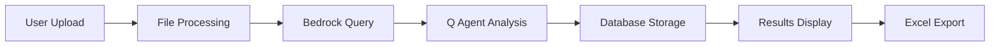
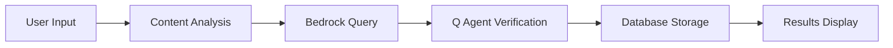
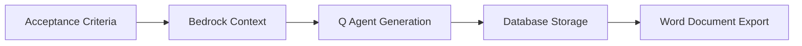
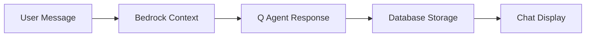
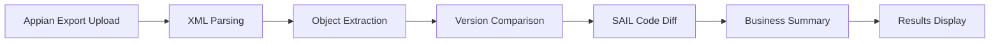
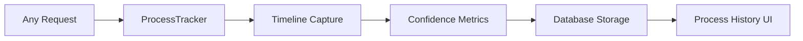

# NexusGen Document Intelligence Hub

> **Version 2.2.0** | A comprehensive Flask-based document intelligence application with AI-powered analysis, generation capabilities, Appian code analysis, and professional-grade refactored architecture.

## 🚀 Overview

NexusGen is a modern document intelligence platform that leverages Amazon Q CLI agents and AWS Bedrock Knowledge Base to provide intelligent document processing, verification, and creation capabilities. Built with Flask and featuring a sleek dark-themed UI, it offers comprehensive functionality through an intuitive web interface with complete process transparency and database-first architecture.

### ✨ Key Features

- **📄 Spec Breakdown**: Upload documents and automatically generate structured user stories and acceptance criteria
- **✅ Design Verification**: Paste design documents for AI-powered validation and recommendations
- **🎨 Design Creation**: Generate comprehensive design documents from acceptance criteria
- **💬 AI Chat Assistant**: Interactive chat interface for document-related queries and assistance
- **📊 Process History**: Complete transparency with timeline tracking, confidence metrics, and debugging info
- **🔍 Database-First Architecture**: All data stored in database with no file dependencies for core operations
- **🏢 Appian Analyzer**: Advanced Appian application analysis with version comparison and SAIL code diff visualization

## 🏗️ Architecture Overview

### System Components (Enhanced v2.2.0)

```
nexus-gen-v2/
├── 🎮 controllers/          # Flask route handlers (Legacy + Refactored)
│   ├── breakdown_controller.py         # Legacy spec breakdown
│   ├── refactored_breakdown_controller.py # Clean architecture example
│   ├── verify_controller.py            # Design verification
│   ├── create_controller.py            # Design document creation
│   ├── chat_controller.py              # AI chat interface
│   ├── process_controller.py           # Process history and details
│   └── analyzer_controller.py          # Appian analyzer interface (NEW)
├── 🏛️ core/                # Clean Architecture Foundation
│   ├── interfaces.py       # Abstract base classes and interfaces
│   ├── exceptions.py       # Custom exception hierarchy
│   ├── container.py        # Dependency injection container
│   └── service_registry.py # Service configuration and registration
├── 🗄️ repositories/        # Data Access Layer
│   ├── request_repository.py # Request entity data access
│   └── chat_repository.py    # Chat session data access
├── ⚙️ services/            # Business Logic Layer (Legacy + Refactored + Appian)
│   ├── processors/         # Specialized Q Agent Processors
│   │   ├── base_processor.py      # Base processor with common functionality
│   │   ├── breakdown_processor.py # Specialized breakdown processing
│   │   ├── verification_processor.py # Specialized verification processing
│   │   └── creation_processor.py  # Specialized creation processing
│   ├── appian_analyzer/    # Appian Analysis Engine (NEW)
│   │   ├── analyzer.py            # Main Appian analyzer service
│   │   ├── parsers.py             # XML parsers for Appian objects
│   │   ├── version_comparator.py  # Version comparison logic
│   │   ├── sail_formatter.py      # SAIL code formatting and cleanup
│   │   ├── business_summary_generator.py # AI-powered business summaries
│   │   ├── models.py              # Appian object data models
│   │   └── schemas/               # JSON schemas and function mappings
│   │       ├── appian_public_functions.json # Function name mappings
│   │       └── object_schemas/    # Object type definitions
│   ├── refactored_bedrock_service.py # Clean Bedrock service
│   ├── refactored_request_service.py # Clean request service
│   ├── request_service.py         # Legacy request management
│   ├── q_agent_service.py         # Legacy Q CLI agent integration
│   ├── bedrock_rag_service.py     # Legacy AWS Bedrock integration
│   ├── data_source_factory.py     # RAG service factory
│   ├── file_service.py            # File handling
│   ├── document_service.py        # Document processing
│   ├── excel_service.py           # Excel generation
│   ├── word_service.py            # Word document generation
│   └── process_tracker.py         # Timeline and metadata tracking
├── 🗄️ models/              # Domain Models (Legacy + Enhanced)
│   └── enhanced_models.py  # Rich domain models with business logic (NEW)
├── 🎨 templates/           # Jinja2 HTML templates
│   ├── breakdown/         # Spec breakdown pages
│   ├── verify/            # Design verification pages
│   ├── create/            # Design creation pages
│   ├── chat/              # AI chat interface
│   ├── process/           # Process history pages
│   ├── process_details.html # Detailed process view
│   └── base.html          # Base template with navigation
├── 📁 static/             # Frontend assets
│   ├── css/docflow.css    # Custom dark theme styles
│   ├── js/main.js         # Core JavaScript utilities
│   └── js/upload.js       # File upload functionality
├── 🧪 tests/              # Comprehensive test suite
├── 📊 outputs/            # Temporary export files (cleaned)
├── 📁 uploads/            # File uploads (cleaned)
├── 📝 logs/               # Application logs (cleaned)
├── 🗄️ models.py           # Legacy SQLAlchemy models
├── ⚙️ config.py           # Application configuration
├── 📖 REFACTORING_GUIDE.md # Detailed refactoring documentation (NEW)
└── 🔧 .amazonq/cli-agents/ # Q CLI agent configurations
```

## 🔄 Data Flow Architecture (Database-First)

### 1. Spec Breakdown Workflow


**Process Details:**
- **FileService**: Validates file types (PDF, DOCX, TXT, MD) and saves uploads
- **DocumentService**: Extracts and normalizes content using text cleaning
- **BedrockRAGService**: Queries KB ID `WAQ6NJLGKN` with summary-first approach and similarity filtering
- **QAgentService**: Processes with `breakdown-agent` returning JSON directly (no file dependencies)
- **ProcessTracker**: Tracks timeline, confidence metrics, and error recovery
- **Database Storage**: All data stored in requests table with complete process metadata
- **ExcelService**: Generates professional Excel reports on-demand

### 2. Design Verification Workflow


**Process Details:**
- **RequestService**: Manages verification requests with process tracking
- **BedrockRAGService**: Finds similar design documents with relevance filtering
- **QAgentService**: Analyzes with `verify-agent` returning structured JSON directly
- **ProcessTracker**: Captures timeline, RAG similarity scores, and confidence indicators
- **Database Storage**: Complete verification data with process transparency

### 3. Design Creation Workflow


**Process Details:**
- **RequestService**: Handles creation requests with comprehensive tracking
- **BedrockRAGService**: Provides design templates with high-quality matches only
- **QAgentService**: Generates designs with `create-agent` using database-first approach
- **ProcessTracker**: Monitors generation timeline and output quality
- **WordService**: Creates structured Word documents on-demand from database

### 4. AI Chat Workflow


**Process Details:**
- **ChatSession**: Persistent conversation tracking with UUID sessions
- **BedrockRAGService**: Contextual document retrieval with summary queries
- **QAgentService**: Conversational AI with `chat-agent` (no file operations)
- **Database Storage**: All chat history and context stored in database

### 5. Appian Analyzer Workflow (NEW)


**Process Details:**
- **FileUpload**: Accepts Appian export ZIP files with XML objects
- **XMLParsers**: Extracts objects (interfaces, process models, rules, etc.)
- **ObjectLookup**: Creates UUID-to-name mapping for readable references
- **VersionComparator**: Compares object versions and identifies changes
- **SAILFormatter**: Cleans SAIL code, replaces UUIDs and function names
- **DiffVisualization**: Side-by-side code comparison with GitHub-style highlighting
- **BusinessSummaryGenerator**: AI-powered analysis of changes and impact
- **ResultsDisplay**: Interactive object browser with detailed diff views

### 6. Process History & Transparency


**Process Details:**
- **ProcessTracker**: Captures step-by-step timing and metadata
- **Confidence Indicators**: RAG similarity, JSON validity, processing time badges
- **Error Recovery**: Tracks fallbacks and retry attempts
- **Process History**: Filterable view with reference IDs and detailed metrics

## 🗄️ Database Schema (Enhanced with Process Tracking)

### Request Model
Tracks all breakdown, verification, and creation operations with complete process transparency:

```sql
CREATE TABLE requests (
    id INTEGER PRIMARY KEY AUTOINCREMENT,
    action_type VARCHAR(20) NOT NULL,     -- 'breakdown', 'verify', 'create'
    filename VARCHAR(255),                -- uploaded file name (breakdown only)
    input_text TEXT,                      -- pasted content (verify/create)
    status VARCHAR(20) DEFAULT 'processing', -- 'processing', 'completed', 'error'
    rag_query TEXT,                       -- query sent to Bedrock
    rag_response TEXT,                    -- Bedrock API response
    final_output TEXT,                    -- Q Agent result (JSON format)
    export_path VARCHAR(500),             -- path to generated export file
    created_at DATETIME DEFAULT CURRENT_TIMESTAMP,
    updated_at DATETIME DEFAULT CURRENT_TIMESTAMP,
    
    -- Step 9: Process Tracking Fields
    reference_id VARCHAR(20),             -- RQ_BR_001 format
    agent_name VARCHAR(50),               -- breakdown-agent, verify-agent, etc.
    model_name VARCHAR(100),              -- amazon.nova-pro-v1:0
    parameters TEXT,                      -- JSON string of model parameters
    total_time INTEGER,                   -- Processing time in seconds
    step_durations TEXT,                  -- JSON timeline data
    raw_agent_output TEXT,                -- Raw Q agent response
    rag_similarity_avg REAL,              -- Average RAG similarity score
    json_valid BOOLEAN DEFAULT 1,         -- JSON validity flag
    error_log TEXT                        -- Error messages and retry attempts
);
```

### ChatSession Model
Manages AI chat conversations:

```sql
CREATE TABLE chat_sessions (
    id INTEGER PRIMARY KEY AUTOINCREMENT,
    session_id VARCHAR(36) NOT NULL,     -- UUID for session grouping
    question TEXT NOT NULL,              -- user message
    rag_response TEXT,                   -- Bedrock context used
    answer TEXT,                         -- AI response
    created_at DATETIME DEFAULT CURRENT_TIMESTAMP
);
```

## 🔧 Key Architectural Improvements

### Clean Architecture Implementation (v2.1.0)
- **SOLID Principles**: All five principles properly implemented
- **Dependency Injection**: Professional service container with lifecycle management
- **Repository Pattern**: Clean data access abstraction layer
- **Interface Segregation**: Small, focused interfaces for better testability
- **Custom Exception Hierarchy**: Structured error handling with proper exception types

### Database-First Approach
- **Single Source of Truth**: All data stored in database, no file dependencies for core operations
- **Process Transparency**: Complete timeline tracking with confidence metrics
- **Error Recovery**: Robust JSON parsing with AI self-validation
- **Performance Optimization**: Reduced I/O operations, faster response times
- **Rich Domain Models**: Enhanced models with business logic and validation

### Enhanced Q Agent Integration
- **Specialized Processors**: Single-responsibility processors for each agent type
- **Base Processor Pattern**: Common functionality abstracted to base class
- **Direct JSON Returns**: Agents return structured data directly (no file saving)
- **Improved Prompts**: Role-based prompts with explicit schemas
- **Model Parameter Tuning**: Optimized temperature, tokens, and topP settings
- **Auto-Review**: AI validates and corrects its own JSON outputs

### Advanced RAG Processing
- **Interface-Based Design**: RAG services implement common interface
- **Summary-First Queries**: Focused queries for better relevance
- **Similarity Filtering**: Only high-quality matches (>0.6 threshold)
- **Text Normalization**: Clean document processing with noise reduction
- **Contextual Grounding**: Better integration of knowledge base content
- **Proper Error Handling**: Structured exceptions with fallback mechanisms

## 🛠️ Service Layer Details

### QAgentService
**Purpose**: Interface with Amazon Q CLI agents for AI processing

**Key Features:**
- **Multi-Agent Support**: breakdown-agent, verify-agent, create-agent, chat-agent
- **Robust JSON Parsing**: Content cleaning, ANSI code removal, markdown stripping
- **Error Recovery**: Fallback responses when agents fail or timeout
- **Timeout Management**: 60-second timeout with graceful handling
- **Content Extraction**: Intelligent JSON extraction from mixed content

**Agent Configurations:**
```python
# Breakdown Agent
prompt = f"""
Analyze the spec document at: {file_path}
Context: {bedrock_summary}
Create JSON with exact structure:
{{"epic": "Name", "stories": [...]}}
Output ONLY valid JSON - no explanations
"""

# Verify Agent  
prompt = f"""
Verify design document: {content}
Context: {bedrock_context}
Analyze for missing objects and recommendations
Output JSON format: {{"status": "verified", "missing_objects": [...], "recommendations": [...]}}
"""
```

### BedrockRAGService
**Purpose**: AWS Bedrock Knowledge Base integration for contextual AI

**Configuration:**
- **Knowledge Base ID**: WAQ6NJLGKN (configurable via environment)
- **Model**: amazon.nova-pro-v1:0
- **Region**: us-east-1 (configurable)

**Key Features:**
- **Similarity Search**: Retrieves relevant documents based on query content
- **Citation Handling**: Processes S3 document references and metadata
- **Response Formatting**: Structures results with similarity scores and summaries
- **Fallback Responses**: Graceful degradation when Bedrock is unavailable
- **Error Handling**: Comprehensive logging and retry mechanisms

### WordService (New in v1.2.0)
**Purpose**: Generate professional Word documents for design exports

**Features:**
- **Structured Layout**: Proper headings, paragraphs, and bullet lists
- **Professional Formatting**: Centered titles, consistent spacing
- **Content Organization**: Overview, Objects & Components, Implementation Notes, Dependencies
- **Library**: python-docx for reliable document generation

**Document Structure:**
```
Design Document
├── Overview (paragraph)
├── Objects & Components
│   ├── Object Name (heading 2)
│   ├── Type & Description
│   └── Methods (bullet list)
├── Implementation Notes (bullet list)
└── Dependencies (bullet list)
```

## 🎨 Frontend Architecture

### UI Framework & Design System
- **Base Framework**: Bootstrap 5 with extensive customizations
- **Icon Library**: Font Awesome 6 for consistent iconography
- **Layout System**: Responsive flexbox with mobile-first approach
- **Theme**: Custom dark theme with purple (#8b5cf6) and teal (#06b6d4) accents

### Color Palette
```css
:root {
    --bg-primary: #0f1419;      /* Main background */
    --bg-secondary: #1a1f2e;    /* Sidebar background */
    --bg-card: #1a1f2e;        /* Card backgrounds */
    --text-primary: #f8fafc;    /* Primary text */
    --text-secondary: #94a3b8;  /* Secondary text */
    --purple: #8b5cf6;          /* Primary accent */
    --teal: #06b6d4;           /* Secondary accent */
    --pink: #ec4899;           /* Chat AI color */
    --green: #10b981;          /* Success color */
}
```

### Key UI Components

#### Collapsible Sidebar
- **Toggle Button**: Circular button at bottom with arrow indicators (< / >)
- **Persistent State**: localStorage saves collapsed/expanded preference
- **Smooth Transitions**: CSS transitions with no-flicker loading
- **Responsive Design**: Auto-collapse on mobile devices

#### Chat Interface (Redesigned in v1.2.0)
- **Message Alignment**: User messages right-aligned, AI messages left-aligned
- **Bubble Design**: Rounded chat bubbles with proper corner radius
- **Avatar System**: 40px circular avatars (teal for user, pink for AI)
- **Input Design**: Rounded input field with embedded circular send button
- **Typing Indicators**: Animated dots during AI response generation

#### Form Components
- **Consistent Styling**: Black backgrounds with white text across all inputs
- **Focus States**: Purple/teal focus borders matching page themes
- **Placeholder Text**: White placeholders with 70% opacity
- **Validation**: Real-time client-side validation with server confirmation

### JavaScript Modules

#### main.js - Core Utilities
```javascript
// Sidebar state management
function initSidebarToggle() {
    // Load saved state, handle transitions, persist changes
}

// Notification system
DocFlow.showNotification(message, type);

// Loading states
DocFlow.showLoading(element);
DocFlow.hideLoading(element);
```

#### upload.js - File Upload System
```javascript
// Drag and drop functionality
// Progress tracking with step-by-step feedback
// Error handling and file validation
// Real-time upload status updates
```

## ⚙️ Configuration Management

### Environment Variables
```bash
# AWS Configuration
AWS_REGION=us-east-1
BEDROCK_KB_ID=WAQ6NJLGKN

# Application Security
SECRET_KEY=your-production-secret-key

# Database (SQLite by default)
SQLALCHEMY_DATABASE_URI=sqlite:///docflow.db

# File Upload Limits
MAX_CONTENT_LENGTH=16777216  # 16MB
```

### File Handling Configuration
```python
# Supported file types
ALLOWED_EXTENSIONS = {'txt', 'md', 'docx', 'pdf'}

# Directory structure
BASE_DIR = Path(__file__).parent
UPLOAD_FOLDER = BASE_DIR / 'uploads'
OUTPUT_FOLDER = BASE_DIR / 'outputs'
```

## 🚀 Installation & Setup

### Prerequisites
- **Python**: 3.8 or higher
- **AWS CLI**: Configured with appropriate permissions
- **Amazon Q CLI**: Installed and configured
- **Git**: For repository cloning

### Quick Start

1. **Clone Repository**
```bash
git clone <repository-url>
cd nexus-gen-v2
```

2. **Create Virtual Environment**
```bash
python -m venv .venv
source .venv/bin/activate  # On Windows: .venv\Scripts\activate
```

3. **Install Dependencies**
```bash
pip install -r requirements.txt
```

4. **Configure Environment**
```bash
export AWS_REGION=us-east-1
export BEDROCK_KB_ID=WAQ6NJLGKN
export SECRET_KEY=your-secret-key
```

5. **Initialize Database**
```bash
python -c "from app import create_app; from models import db; app = create_app(); app.app_context().push(); db.create_all()"
```

6. **Run Application**
```bash
python app.py
```

7. **Access Application**
Open browser to `http://localhost:5001`

### Production Deployment

#### Using Gunicorn
```bash
pip install gunicorn
gunicorn -w 4 -b 0.0.0.0:5001 app:app
```

#### Using Docker
```dockerfile
FROM python:3.11-slim
WORKDIR /app
COPY requirements.txt .
RUN pip install -r requirements.txt
COPY . .
EXPOSE 5001
CMD ["gunicorn", "-w", "4", "-b", "0.0.0.0:5001", "app:app"]
```

## 🧪 Testing & Quality Assurance

### Test Suite Overview
Comprehensive testing infrastructure with multiple test categories:

#### Test Categories
- **Health Tests**: Application health monitoring and system checks
- **Unit Tests**: Individual service and model testing
- **Integration Tests**: End-to-end workflow validation
- **Controller Tests**: API endpoint testing with mocked services
- **Performance Tests**: Memory usage and concurrent request handling

#### Running Tests

**Quick Health Check** (30 seconds):
```bash
./health_check.py
```

**Specific Test Categories**:
```bash
python run_tests.py --type health      # Health checks only
python run_tests.py --type unit        # Unit tests (models, services)
python run_tests.py --type integration # End-to-end workflows
python run_tests.py --type controllers # API endpoint tests
python run_tests.py --type performance # Performance benchmarks
python run_tests.py --type all         # Complete test suite
```

**Install Test Dependencies**:
```bash
pip install -r test_requirements.txt
```

#### Health Monitoring Features
- **Database Connectivity**: Ensures SQLite database is accessible
- **Route Accessibility**: Tests all main endpoints respond correctly
- **Bedrock Integration**: Validates AWS service connectivity
- **File Processing**: Tests document extraction and validation
- **JSON Parsing**: Validates Q Agent response handling
- **Error Handling**: Ensures graceful error responses
- **Memory Usage**: Monitors application resource consumption
- **Configuration Validation**: Checks all required settings

### Test Coverage Areas
```python
# Example health check test
def test_complete_breakdown_workflow(self):
    """Test end-to-end breakdown functionality"""
    # Upload file → Process → Generate breakdown → Export
    # Validates entire user journey
```

## 📈 Performance & Optimization

### Performance Characteristics
- **Response Times**: < 2 seconds for page loads
- **Memory Usage**: < 500MB during normal operation
- **File Processing**: Handles up to 16MB documents
- **Concurrent Users**: Supports multiple simultaneous requests
- **Q Agent Timeout**: 60 seconds for complex processing

### Optimization Strategies

#### Caching
- **Browser localStorage**: UI state persistence (sidebar, preferences)
- **Python bytecode**: Automatic .pyc file management
- **Static assets**: Proper cache headers for CSS/JS files

#### Resource Management
- **File Streaming**: Efficient large file processing
- **Memory Management**: Automatic cleanup of temporary files
- **Connection Pooling**: SQLAlchemy database connection optimization
- **Lazy Loading**: On-demand service initialization

#### Error Handling & Resilience
- **Graceful Degradation**: Fallback responses when services unavailable
- **Retry Logic**: Automatic retry for transient failures
- **Circuit Breaker**: Prevents cascade failures in service calls
- **Comprehensive Logging**: Detailed error tracking without sensitive data

## 🔒 Security Considerations

### Input Validation & Sanitization
- **File Type Validation**: Strict whitelist of allowed file extensions
- **Content Sanitization**: XSS prevention with Jinja2 auto-escaping
- **SQL Injection Prevention**: SQLAlchemy ORM with parameterized queries
- **File Size Limits**: 16MB maximum upload size
- **Path Traversal Protection**: Secure file storage with UUID naming

### Authentication & Authorization
- **Session Management**: Secure Flask sessions with secret key rotation
- **CSRF Protection**: Built-in Flask-WTF CSRF tokens
- **Input Validation**: Server-side validation for all user inputs
- **Error Information**: User-friendly messages without system details

### Data Protection
- **Sensitive Data Handling**: No storage of AWS credentials in code
- **Temporary File Cleanup**: Automatic removal of processed files
- **Audit Trail**: Complete request tracking for compliance
- **Environment Variables**: Secure configuration management

## 🔄 Version History & Changelog

### Version 2.2.0 (Current) - November 18, 2025

#### 🏢 **Appian Analyzer - Advanced Code Analysis Engine**

**Core Appian Analysis Features:**
- ✅ **XML Export Processing**: Upload and parse Appian application export ZIP files
- ✅ **Object Extraction**: Parse interfaces, process models, rules, constants, and other Appian objects
- ✅ **Version Comparison**: Compare different versions of Appian applications with detailed change tracking
- ✅ **SAIL Code Diff**: Side-by-side SAIL code comparison with GitHub-style diff visualization
- ✅ **UUID Resolution**: Replace UUIDs with readable object names for better code comprehension
- ✅ **Function Name Mapping**: Replace internal Appian function calls with public-facing names
- ✅ **Business Impact Analysis**: AI-powered summaries of changes and their business implications

**Technical Implementation:**
- ✅ **XML Parsers**: Specialized parsers for different Appian object types (interfaces, rules, etc.)
- ✅ **Object Models**: Rich data models for Appian objects with proper relationships
- ✅ **SAIL Formatter**: Advanced code formatter with UUID replacement and function name mapping
- ✅ **Version Comparator**: Intelligent comparison engine that identifies added, modified, and removed objects
- ✅ **Diff Visualization**: Professional diff viewer with line-by-line comparison and syntax highlighting
- ✅ **Schema Definitions**: JSON schemas for object validation and function mappings

**User Experience Enhancements:**
- ✅ **Interactive Object Browser**: Navigate through application structure with expandable tree view
- ✅ **Detailed Object Views**: Comprehensive object details with metadata and SAIL code
- ✅ **Search and Filter**: Find specific objects quickly with advanced filtering options
- ✅ **Export Capabilities**: Generate reports and summaries of application changes
- ✅ **Responsive Design**: Mobile-friendly interface that works across all devices

**Architecture Improvements:**
- ✅ **Modular Design**: Clean separation between parsers, comparators, and formatters
- ✅ **Error Handling**: Robust error handling for malformed XML and missing objects
- ✅ **Performance Optimization**: Efficient processing of large Appian applications
- ✅ **Extensible Framework**: Easy to add support for new Appian object types

### Version 2.1.0 - October 26, 2025

#### 🏗️ **Major Architecture Refactoring - Clean Architecture Implementation**

**Core Architecture Foundation:**
- ✅ **Abstract Base Classes**: Created foundational interfaces (`RAGServiceInterface`, `ProcessorInterface`, `RepositoryInterface`)
- ✅ **Dependency Injection Container**: Professional service management with singleton/transient lifecycle
- ✅ **Custom Exception Hierarchy**: Structured error handling (`NexusGenException`, `ServiceException`, `ValidationException`)
- ✅ **Service Registry**: Centralized service configuration and registration

**Repository Pattern Implementation:**
- ✅ **RequestRepository**: Clean data access abstraction for request entities
- ✅ **ChatRepository**: Clean data access abstraction for chat sessions
- ✅ **Interface-Based Design**: All repositories implement `RepositoryInterface`
- ✅ **Proper Error Handling**: Database operations with rollback and structured exceptions

**Specialized Q Agent Processors:**
- ✅ **BaseQAgentProcessor**: Common functionality abstracted to base class
- ✅ **BreakdownProcessor**: Specialized processor for spec breakdown operations
- ✅ **VerificationProcessor**: Specialized processor for design verification
- ✅ **CreationProcessor**: Specialized processor for design creation
- ✅ **Single Responsibility**: Each processor handles one specific agent type

**Enhanced Services:**
- ✅ **RefactoredBedrockRAGService**: Clean Bedrock service implementing `RAGServiceInterface`
- ✅ **RefactoredRequestService**: Request service with proper dependency injection
- ✅ **Service Abstractions**: All services extend `BaseService` with common functionality
- ✅ **Proper Logging**: Lazy logger initialization and structured logging

**Rich Domain Models:**
- ✅ **EnhancedRequest**: Rich domain model with business logic and validation
- ✅ **RequestStatus & ActionType**: Type-safe constants with validation
- ✅ **Business Methods**: `is_completed()`, `get_confidence_score()`, `mark_completed()`
- ✅ **Computed Properties**: Timeline data parsing, confidence scoring

**SOLID Principles Implementation:**
- ✅ **Single Responsibility**: Each class has one clear purpose
- ✅ **Open/Closed**: Easy to extend without modifying existing code
- ✅ **Liskov Substitution**: All implementations are interchangeable
- ✅ **Interface Segregation**: Small, focused interfaces
- ✅ **Dependency Inversion**: Depend on abstractions, not concretions

**Code Quality Improvements:**
- ✅ **Repository Cleanup**: Removed obsolete files, duplicate code, and development artifacts
- ✅ **Proper .gitignore**: Prevents accumulation of unwanted files
- ✅ **Documentation**: Comprehensive `REFACTORING_GUIDE.md` with migration examples
- ✅ **Migration Script**: `migrate_to_refactored.py` for testing new architecture
- ✅ **Backward Compatibility**: Legacy code preserved for gradual migration

**Professional Standards Achieved:**
- ✅ **Testability**: Easy to mock dependencies for unit testing
- ✅ **Maintainability**: Clear separation of concerns and clean code structure
- ✅ **Extensibility**: New features can be added without modifying existing code
- ✅ **Error Handling**: Structured exception hierarchy with proper error recovery
- ✅ **Performance**: Optimized service lifecycle management

### Version 1.2.0 - October 16, 2025

#### 🎨 Major UI/UX Enhancements

**Navigation & Layout Improvements:**
- ✅ **Collapsible Sidebar**: Added toggle button at bottom with circular design and arrow indicators (< / >)
- ✅ **Persistent State Management**: Sidebar collapse state saved in localStorage across page navigation
- ✅ **Smooth Transitions**: Added CSS transitions with no-flicker page loading using temporary no-transition classes
- ✅ **Full-width Chat Interface**: Removed card container constraints for immersive chat experience

**Page-Specific Optimizations:**
- ✅ **Spec Breakdown**: Removed preview panel, added inline progress indicators with real-time step-by-step feedback
- ✅ **Create Design**: Removed recent generations section, increased panel heights to standardized 600px
- ✅ **Verify Design**: Removed recent verifications section, standardized panel heights for consistency
- ✅ **Dashboard**: Removed bottom metrics section for cleaner, more focused interface

**Form & Input Enhancements:**
- ✅ **Consistent Input Styling**: Black backgrounds with white text and placeholders across all pages
- ✅ **Enhanced Focus States**: Purple/teal focus borders matching individual page themes
- ✅ **Improved Spacing**: Better padding, margins, and layout consistency throughout application

#### 💬 Complete Chat Interface Overhaul

**Message Layout & Design:**
- ✅ **Proper Message Alignment**: User messages right-aligned, AI messages left-aligned matching modern chat apps
- ✅ **Chat Bubble Design**: Rounded corners with different radius for each message type (user vs AI)
- ✅ **Avatar Positioning**: 40px avatars with proper left/right positioning based on sender
- ✅ **Color Scheme**: Purple background for user messages, pink background for AI messages

**Input & Interaction:**
- ✅ **Rounded Input Design**: Pill-shaped input field with embedded circular send button
- ✅ **Better Typography**: Improved font sizes and spacing for readability
- ✅ **Responsive Layout**: Full-width design that adapts to different screen sizes

#### 🔧 Critical Technical Improvements

**Q Agent System Enhancements:**
- ✅ **Robust JSON Parsing**: Added content cleaning, ANSI code removal, and markdown stripping
- ✅ **Error Recovery System**: Intelligent JSON extraction from mixed content with fallback responses
- ✅ **Timeout Management**: Increased timeout from 30s to 60s with proper error handling
- ✅ **Improved Prompts**: Simplified, more effective prompts with clear JSON structure requirements

**File Upload System Fixes:**
- ✅ **Event Handling**: Fixed double-trigger issues causing file dialog to open twice
- ✅ **State Management**: Proper file input reset after processing to allow same file re-selection
- ✅ **Progress Feedback**: Real-time progress updates with descriptive step messages

**Export Functionality Overhaul:**
- ✅ **Word Document Export**: Changed create design export from Excel to professional Word (.docx) format
- ✅ **Document Structure**: Proper headings, bullet lists, and professional formatting
- ✅ **New WordService**: Dedicated service using python-docx for reliable document generation

#### 🧪 Comprehensive Testing Infrastructure

**Test Suite Development:**
- ✅ **Health Check System**: Quick 30-second health validation for deployment confidence
- ✅ **Categorized Testing**: Organized tests by type (health, unit, integration, controllers, performance)
- ✅ **Performance Monitoring**: Memory usage tracking and concurrent request handling tests
- ✅ **Integration Validation**: End-to-end workflow testing for all four core features

**Quality Assurance Tools:**
- ✅ **Automated Test Runner**: Enhanced test runner with detailed reporting and failure analysis
- ✅ **Health Monitoring Script**: Standalone script for production health checks
- ✅ **Test Coverage**: Comprehensive coverage of all critical application paths

#### 🛠️ Backend Architecture Improvements

**Service Layer Enhancements:**
- ✅ **Enhanced Error Handling**: Better exception handling with detailed logging across all services
- ✅ **Service Separation**: Clean separation between Excel and Word document generation services
- ✅ **Improved Logging**: More detailed error messages and debug information for troubleshooting

**Configuration & Deployment:**
- ✅ **Environment Management**: Better handling of AWS configuration and environment variables
- ✅ **Cache Management**: Automatic Python cache cleanup to prevent deployment issues
- ✅ **Directory Organization**: Improved file organization and cleanup policies

#### 📊 Data Management & Storage

**Request Tracking Improvements:**
- ✅ **Complete Audit Trail**: Enhanced tracking for all breakdown/verify/create operations
- ✅ **Chat History Management**: Persistent chat sessions with proper cleanup and organization
- ✅ **Export Path Tracking**: Better management of generated files for download and cleanup
- ✅ **Status Management**: Real-time status updates for long-running operations

#### 🎯 User Experience Enhancements

**Interface Standardization:**
- ✅ **Consistent Panel Heights**: Standardized 600px heights across create/verify pages for visual harmony
- ✅ **Better User Feedback**: Enhanced loading states, progress indicators, and success messages
- ✅ **Keyboard Shortcuts**: Proper Enter key handling in chat, improved form interactions
- ✅ **Responsive Design**: Better mobile and tablet compatibility across all features

#### 🔒 Reliability & Performance

**System Reliability:**
- ✅ **Timeout Management**: Proper handling of long-running Q Agent operations with user feedback
- ✅ **Memory Optimization**: More efficient file handling and automatic cleanup procedures
- ✅ **Error Recovery**: Graceful fallbacks when external services (Bedrock, Q Agents) are unavailable
- ✅ **State Persistence**: Reliable sidebar and form state management across sessions

### Technical Stack Updates
- ✅ **Added**: python-docx library for professional Word document generation
- ✅ **Enhanced**: Q Agent integration with robust JSON parsing and error handling
- ✅ **Improved**: Bedrock RAG service with comprehensive error handling and fallbacks
- ✅ **Optimized**: Frontend JavaScript for better user interactions and state management

### Breaking Changes (v2.1.0)
- ⚠️ **Architecture**: New refactored services available alongside legacy code
- ⚠️ **Dependencies**: New core modules require proper import paths
- ⚠️ **Service Registration**: DI container must be initialized before service usage

### Migration Notes (v2.1.0)
- 🔄 **Gradual Migration**: Legacy code preserved - migrate controllers incrementally
- 🔄 **Service Container**: Use `container.get(ServiceClass)` for dependency injection
- 🔄 **Testing**: New architecture provides better mocking capabilities
- 🔄 **Error Handling**: Update exception handling to use new exception hierarchy

### Legacy Breaking Changes (v1.2.0)
- ⚠️ **Export Format Change**: Design document export changed from Excel to Word format
- ⚠️ **Sidebar Behavior**: Sidebar state now persists across browser sessions
- ⚠️ **Chat Interface**: Complete redesign may affect users familiar with previous layout

## 🤝 Contributing

### Development Setup
1. Fork the repository
2. Create feature branch: `git checkout -b feature/amazing-feature`
3. Install development dependencies: `pip install -r test_requirements.txt`
4. Test refactored architecture: `python migrate_to_refactored.py`
5. Run tests: `python run_tests.py --type all`
6. Commit changes: `git commit -m 'Add amazing feature'`
7. Push to branch: `git push origin feature/amazing-feature`
8. Open Pull Request

### Code Standards (Updated v2.1.0)
- **Python**: Follow PEP 8 style guidelines with type hints
- **Architecture**: Follow SOLID principles and clean architecture patterns
- **Dependency Injection**: Use service container for all dependencies
- **Error Handling**: Use custom exception hierarchy
- **JavaScript**: Use ES6+ features with proper error handling
- **HTML/CSS**: Maintain Bootstrap 5 compatibility
- **Testing**: Add tests for new features with proper mocking
- **Documentation**: Update README and REFACTORING_GUIDE for significant changes

### Development Guidelines (Updated v2.1.0)
- **Clean Architecture**: Follow established patterns in `core/` and `repositories/`
- **Dependency Injection**: Register services in `core/service_registry.py`
- **Single Responsibility**: Each class should have one clear purpose
- **Interface Segregation**: Create focused interfaces for new components
- **Repository Pattern**: Use repositories for all data access
- **Service Layer**: Keep business logic in services, not controllers
- **Error Handling**: Use structured exceptions with proper recovery
- **Testing**: Mock dependencies using interfaces for better unit tests
- **Migration**: Prefer refactored services for new features
- **Legacy Support**: Maintain backward compatibility during transition

## 📞 Support & Troubleshooting

### Common Issues

**Q Agent Timeout Errors:**
```bash
# Check Q CLI installation
q --version

# Verify agent availability
q chat --agent breakdown-agent --help
```

**Bedrock Connection Issues:**
```bash
# Verify AWS credentials
aws sts get-caller-identity

# Test Bedrock access
aws bedrock-agent-runtime retrieve-and-generate --help
```

**File Upload Problems:**
- Check file size (max 16MB)
- Verify file type (PDF, DOCX, TXT, MD only)
- Clear browser cache and localStorage

**Database Issues:**
```bash
# Recreate database
python -c "from app import create_app; from models import db; app = create_app(); app.app_context().push(); db.drop_all(); db.create_all()"
```

### Health Check Commands
```bash
# Quick health check
./health_check.py

# Test refactored architecture
python migrate_to_refactored.py

# Detailed system check
python run_tests.py --type health

# Performance validation
python run_tests.py --type performance
```

### Logging & Debugging
- **Application logs**: Check `app.log` for detailed error information
- **Q Agent logs**: Monitor console output during agent execution
- **Browser console**: Check for JavaScript errors in developer tools
- **Network tab**: Monitor API calls and response times

## 📄 License

This project is licensed under the MIT License - see the LICENSE file for details.

## 🙏 Acknowledgments

- **Amazon Q CLI**: For powerful AI agent capabilities
- **AWS Bedrock**: For knowledge base and AI model access
- **Flask Community**: For excellent web framework and extensions
- **Bootstrap Team**: For responsive UI framework
- **Font Awesome**: For comprehensive icon library

---

**NexusGen Document Intelligence Hub v2.1.0**  
*Built with ❤️ for intelligent document processing*  
*Professional-grade architecture with clean code principles*  
*Last Updated: October 26, 2025*
