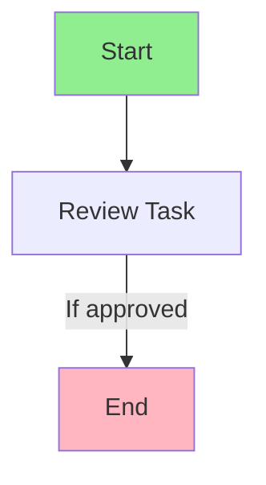

# Process Model Enhancement Module - Developer Guide

## Overview

The `process_model_enhancement.py` module provides comprehensive parsing and visualization capabilities for Appian Process Models. It transforms raw XML into structured, human-readable information about nodes, flows, and process logic.

## Architecture

### Core Components

1. **Data Models** - Structured representations of process model elements
2. **Extractors** - Parse XML and extract structured information
3. **Comparators** - Compare process models between versions
4. **Renderers** - Format data for HTML display
5. **Diagram Generators** - Create visual flow diagrams

## Data Structures

### EnhancedNode

Represents a complete process model node with all properties and dependencies.

```python
from services.appian_analyzer.process_model_enhancement import EnhancedNode, NodeType, NodeProperties

# Create a node
node = EnhancedNode(
    uuid="_a-0001ed6e-54f1-8000-9df6-011c48011c48",
    name="Review Application",
    node_type=NodeType.USER_INPUT_TASK,
    properties=NodeProperties(
        basic={'description': 'Review the application for approval'},
        assignment={'type': 'GROUP', 'assignees': ['Reviewers']},
        forms={'interface_name': 'ReviewForm'}
    )
)

# Convert to dictionary for JSON serialization
node_dict = node.to_dict()
```

### Flow

Represents a connection between two nodes in the process flow.

```python
from services.appian_analyzer.process_model_enhancement import Flow

# Create a flow
flow = Flow(
    uuid="_flow-123",
    from_node_uuid="_a-node1",
    from_node_name="Start",
    to_node_uuid="_a-node2",
    to_node_name="Review",
    condition="ri!approved = true",
    is_default=False,
    label="If approved"
)
```

### FlowGraph

Represents the complete process flow structure.

```python
from services.appian_analyzer.process_model_enhancement import FlowGraph

# Flow graph identifies start/end nodes and connections
flow_graph = FlowGraph(
    start_nodes=["_a-start-node"],
    end_nodes=["_a-end-node"],
    node_connections={
        "_a-node1": {
            'incoming': [],
            'outgoing': [flow1, flow2]
        }
    }
)
```

## Extractors

### NodeExtractor

Extracts structured information from process model node XML elements.

**Usage Example:**

```python
from services.appian_analyzer.process_model_enhancement import NodeExtractor
from services.appian_analyzer.sail_formatter import SAILFormatter
import xml.etree.ElementTree as ET

# Initialize with object lookup and SAIL formatter
object_lookup = {
    "_a-interface-uuid": {
        'name': 'ReviewInterface',
        'object_type': 'Interface'
    }
}

sail_formatter = SAILFormatter(object_lookup)
extractor = NodeExtractor(object_lookup, sail_formatter)

# Parse node XML
node_xml = """
<node uuid="_a-node1">
    <ac>
        <name>Review Task</name>
        <form-config>
            <uiExpressionForm>
                <expression>#"_a-interface-uuid"</expression>
            </uiExpressionForm>
        </form-config>
        <assignment>
            <group>_a-group-uuid</group>
        </assignment>
    </ac>
</node>
"""

node_elem = ET.fromstring(node_xml)
node_data = extractor.extract_node(node_elem)

# Result includes:
# - uuid, name, type
# - properties (basic, assignment, forms, expressions, escalation)
# - dependencies (interfaces, rules, groups)
```

**Key Methods:**

- `extract_node(node_elem)` - Extract complete node information
- `determine_node_type(ac_elem)` - Identify node type from structure
- `extract_assignment(ac_elem)` - Extract assignment configuration
- `extract_escalation(ac_elem)` - Extract escalation rules
- `extract_form_config(ac_elem)` - Extract interface configuration
- `extract_expressions(ac_elem)` - Extract all SAIL expressions
- `track_variable_usage(node_uuid, ac_elem)` - Track variable references

### VariableExtractor

Extracts process variable definitions and tracks their usage.

**Usage Example:**

```python
from services.appian_analyzer.process_model_enhancement import VariableExtractor

extractor = VariableExtractor()

# Extract variables from process model XML
variables = extractor.extract_variables(pm_elem)

# Update variable usage based on node analysis
variables = extractor.update_variable_usage(
    variables,
    node_uuid="_a-node1",
    node_name="Review Task",
    variable_usage={
        'used': {'applicationId', 'reviewerComments'},
        'modified': {'approvalStatus'}
    }
)

# Result includes:
# - name, type, parameter status
# - used_in_nodes, modified_by_nodes lists
```

### FlowExtractor

Extracts flow connections and builds flow graphs.

**Usage Example:**

```python
from services.appian_analyzer.process_model_enhancement import FlowExtractor

# Initialize with node lookup for name resolution
node_lookup = {
    "_a-node1": "Start",
    "_a-node2": "Review",
    "_a-node3": "End"
}

extractor = FlowExtractor(node_lookup, sail_formatter)

# Extract flows from process model XML
flows = extractor.extract_flows(pm_elem)

# Build flow graph
flow_graph = extractor.build_flow_graph(nodes, flows)

# Result includes:
# - start_nodes, end_nodes
# - node_connections with incoming/outgoing flows
```

## Comparators

### NodeComparator

Compares nodes between process model versions.

**Usage Example:**

```python
from services.appian_analyzer.process_model_enhancement import NodeComparator

comparator = NodeComparator()

# Compare nodes between versions
comparison = comparator.compare_nodes(base_nodes, target_nodes)

# Result includes:
# - added: nodes only in target
# - removed: nodes only in base
# - modified: nodes with property changes
# - unchanged: nodes with no changes

# Compare flows
flow_comparison = comparator.compare_flows(base_flows, target_flows)

# Result includes:
# - added_flows, removed_flows, modified_flows, unchanged_flows
```

**Property-Level Comparison:**

The comparator performs deep comparison of node properties:

```python
# For modified nodes, get detailed property changes
for modified in comparison['modified']:
    node = modified['node']
    changes = modified['changes']
    
    for change in changes:
        print(f"Property: {change['property']}")
        print(f"Before: {change['before']}")
        print(f"After: {change['after']}")
```

## Renderers

### ProcessModelRenderer

Renders process model data as HTML for display.

**Usage Example:**

```python
from services.appian_analyzer.process_model_enhancement import ProcessModelRenderer

renderer = ProcessModelRenderer()

# Render single node summary
node_html = renderer.render_node_summary(node_dict)

# Render property group
assignment_html = renderer.render_property_group(
    'Assignment',
    node_dict['properties']['assignment']
)

# Render three-way comparison
comparison_html = renderer.render_node_comparison(
    base_node=base_node_dict,
    target_node=target_node_dict,
    changes=property_changes
)
```

**HTML Output Structure:**

```html
<div class="node-summary">
    <div class="node-header">
        <h4 class="node-name">Review Task</h4>
        <span class="node-type badge badge-info">USER_INPUT_TASK</span>
    </div>
    <div class="property-group">
        <h5>Assignment</h5>
        <div class="property-list">
            <div class="property-item">
                <span class="property-name">Type:</span>
                <span class="property-value">GROUP</span>
            </div>
        </div>
    </div>
</div>
```

## Diagram Generators

### FlowDiagramGenerator

Generates Mermaid.js compatible flow diagrams.

**Usage Example:**

```python
from services.appian_analyzer.process_model_enhancement import FlowDiagramGenerator

generator = FlowDiagramGenerator()

# Generate diagram data
diagram_data = generator.generate_diagram_data(nodes, flows, flow_graph)

# Result includes:
# - mermaid_syntax: Complete Mermaid.js syntax string
# - nodes: Node data with shapes and positions
# - edges: Edge data with labels and conditions
# - start_nodes, end_nodes: Special node identifiers

# Generate comparison diagram with change highlighting
comparison_diagram = generator.generate_comparison_diagram(
    base_diagram=base_diagram_data,
    target_diagram=target_diagram_data,
    node_changes=node_comparison,
    flow_changes=flow_comparison
)

# Result includes change highlighting:
# - Added nodes: green
# - Removed nodes: red
# - Modified nodes: yellow
```

**Mermaid.js Output:**



## Integration with Existing Code

### In ProcessModelParser

```python
from services.appian_analyzer.process_model_enhancement import (
    NodeExtractor,
    FlowExtractor,
    VariableExtractor
)

class ProcessModelParser:
    def parse(self, xml_content, object_lookup):
        # Initialize extractors
        node_extractor = NodeExtractor(object_lookup, self.sail_formatter)
        flow_extractor = FlowExtractor({}, self.sail_formatter)
        var_extractor = VariableExtractor()
        
        # Parse XML
        root = ET.fromstring(xml_content)
        
        # Extract nodes
        nodes = []
        for node_elem in root.findall('.//node'):
            node_data = node_extractor.extract_node(node_elem)
            nodes.append(node_data)
        
        # Extract flows
        node_lookup = {n['uuid']: n['name'] for n in nodes}
        flow_extractor.node_lookup = node_lookup
        flows = flow_extractor.extract_flows(root)
        
        # Build flow graph
        flow_graph = flow_extractor.build_flow_graph(nodes, flows)
        
        # Extract variables
        variables = var_extractor.extract_variables(root)
        
        return {
            'nodes': nodes,
            'flows': flows,
            'flow_graph': flow_graph,
            'variables': variables
        }
```

### In ThreeWayComparisonService

```python
from services.appian_analyzer.process_model_enhancement import NodeComparator

class ThreeWayComparisonService:
    def compare_process_models(self, base_pm, customer_pm, vendor_pm):
        comparator = NodeComparator()
        
        # Compare nodes
        base_vs_customer = comparator.compare_nodes(
            base_pm['nodes'],
            customer_pm['nodes']
        )
        
        base_vs_vendor = comparator.compare_nodes(
            base_pm['nodes'],
            vendor_pm['nodes']
        )
        
        # Compare flows
        flow_comparison = comparator.compare_flows(
            base_pm['flows'],
            vendor_pm['flows']
        )
        
        return {
            'node_comparison': base_vs_vendor,
            'flow_comparison': flow_comparison
        }
```

### In Templates

```html
<!-- change_detail.html -->

    <div class="process-model-visualization">
        <!-- Node Summary -->
        <div class="node-summary-section">
            {{ node_summary_html|safe }}
        </div>
        
        <!-- Flow Diagram -->
        <div class="flow-diagram-section">
            <div class="mermaid">
                {{ mermaid_syntax }}
            </div>
        </div>
        
        <!-- Three-Way Comparison -->
        <div class="comparison-section">
            {{ comparison_html|safe }}
        </div>
    </div>

```

## Error Handling

All extractors and renderers include comprehensive error handling:

```python
try:
    node_data = extractor.extract_node(node_elem)
except Exception as e:
    logger.error(f"Error extracting node: {e}", exc_info=True)
    # Returns minimal node structure with error indication
    node_data = {
        'uuid': 'unknown',
        'name': 'Parse Error',
        'type': 'UNKNOWN',
        'error': str(e)
    }
```

**Fallback Behavior:**

- **Malformed XML**: Returns minimal structure with error message
- **Missing Elements**: Continues parsing with empty values
- **UUID Resolution Failure**: Shows "Unknown (uuid...)" instead of name
- **Rendering Errors**: Shows error alert instead of crashing

## Logging

The module uses structured logging for debugging and monitoring:

```python
from services.appian_analyzer.process_model_enhancement import (
    log_parsing_start,
    log_parsing_complete,
    log_parsing_error,
    log_node_extraction,
    log_flow_extraction,
    log_uuid_resolution,
    log_uuid_resolution_failure,
    log_fallback_to_raw_xml
)

# Log parsing lifecycle
log_parsing_start("MyProcessModel", node_count=10)
# ... parsing logic ...
log_parsing_complete("MyProcessModel", nodes_parsed=10, flows_parsed=15)

# Log individual extractions
log_node_extraction("Review Task", NodeType.USER_INPUT_TASK)
log_flow_extraction("Start", "Review", has_condition=True)

# Log UUID resolution
log_uuid_resolution("_a-uuid", "ReviewInterface", "Interface")
log_uuid_resolution_failure("_a-unknown-uuid", "node assignment")

# Log errors
log_parsing_error("MyProcessModel", exception, "extracting nodes")
log_fallback_to_raw_xml("MyProcessModel", "malformed AC element")
```

## Performance Considerations

### Large Process Models

For process models with 50+ nodes:

1. **Parsing**: Typically < 5 seconds
2. **Comparison**: Typically < 10 seconds
3. **Rendering**: Lazy loading for large node lists
4. **Diagrams**: Automatic layout may be slow, consider manual positioning

### Optimization Tips

```python
# Use node lookup dictionaries for O(1) access
node_lookup = {node['uuid']: node for node in nodes}

# Batch UUID resolution
uuids_to_resolve = set()
for node in nodes:
    # Collect all UUIDs first
    uuids_to_resolve.update(extract_uuids(node))

# Resolve in batch
resolved = {uuid: resolve_uuid(uuid) for uuid in uuids_to_resolve}
```

## Testing

### Unit Tests

```python
from hypothesis import given, strategies as st
from services.appian_analyzer.process_model_enhancement import NodeExtractor

@given(node_xml=st.text())
def test_node_extraction_handles_invalid_xml(node_xml):
    """Property: NodeExtractor handles invalid XML gracefully"""
    extractor = NodeExtractor({}, None)
    
    try:
        node_elem = ET.fromstring(node_xml)
        result = extractor.extract_node(node_elem)
        
        # Should always return a dict with required fields
        assert 'uuid' in result
        assert 'name' in result
        assert 'type' in result
    except ET.ParseError:
        # XML parsing errors are expected for invalid input
        pass
```

### Integration Tests

```python
def test_end_to_end_process_model_parsing():
    """Test complete parsing workflow"""
    # Load real process model XML
    with open('test_process_model.xml') as f:
        xml_content = f.read()
    
    # Parse with all extractors
    parser = ProcessModelParser()
    result = parser.parse(xml_content, object_lookup)
    
    # Verify structure
    assert 'nodes' in result
    assert 'flows' in result
    assert 'flow_graph' in result
    assert len(result['nodes']) > 0
    assert len(result['flows']) > 0
```

## Troubleshooting

### Common Issues

**Issue: UUIDs not resolving to names**

```python
# Check object_lookup is populated
print(f"Object lookup has {len(object_lookup)} entries")

# Verify UUID format
uuid = "_a-0001ed6e-54f1-8000-9df6-011c48011c48"
if uuid in object_lookup:
    print(f"Found: {object_lookup[uuid]['name']}")
else:
    print(f"UUID not in lookup")
```

**Issue: Node type showing as UNKNOWN**

```python
# Check AC element structure
ac_elem = node_elem.find('.//ac')
print(ET.tostring(ac_elem, encoding='unicode'))

# Manually determine type
if ac_elem.find('.//form-config') is not None:
    print("Should be USER_INPUT_TASK")
```

**Issue: Flows not connecting properly**

```python
# Verify node UUIDs match flow references
node_uuids = {node['uuid'] for node in nodes}
for flow in flows:
    if flow['from_node_uuid'] not in node_uuids:
        print(f"Flow references unknown source: {flow['from_node_uuid']}")
    if flow['to_node_uuid'] not in node_uuids:
        print(f"Flow references unknown target: {flow['to_node_uuid']}")
```

## API Reference

See inline docstrings in `process_model_enhancement.py` for complete API documentation. All classes and methods include:

- Purpose and requirements
- Parameter descriptions with types
- Return value descriptions with structure
- Usage examples where applicable
- Error handling behavior

## Version History

- **v1.0** (2024-11): Initial implementation with node extraction, flow parsing, and comparison
- **v1.1** (2024-11): Added variable tracking and enhanced error handling
- **v1.2** (2024-11): Added HTML rendering and Mermaid.js diagram generation

## Contributing

When adding new features to this module:

1. Add comprehensive docstrings following existing format
2. Include usage examples in docstrings
3. Add logging for debugging
4. Implement error handling with fallback behavior
5. Write property-based tests for core logic
6. Update this guide with new functionality
